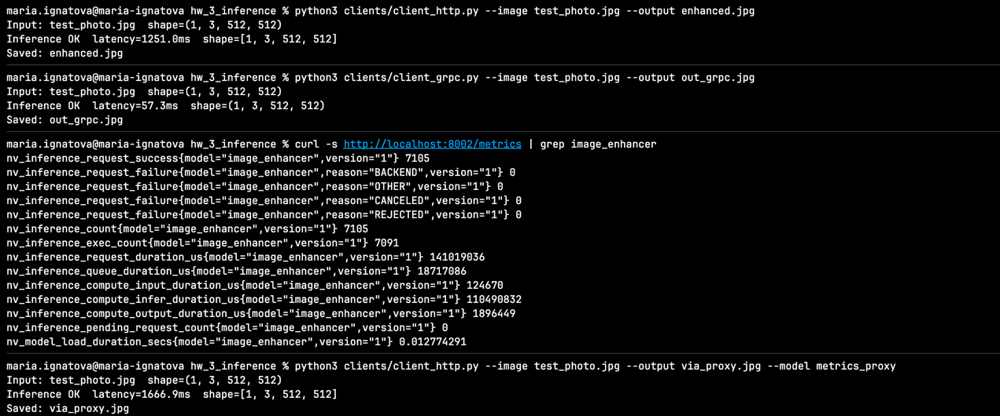

# ДЗ3. Инференс модели улучшения изображений

## Описание

Image-adaptive 3D LUT модель для автоматического улучшения фотографий, развёрнутая через Triton Inference Server.

Модель обучена на датасете MIT-Adobe FiveK (Expert C), использует 3 обучаемые 3D LUT-таблицы с весами, предсказываемыми лёгким CNN (~68K параметров).

## Быстрый старт (macOS, без GPU)

```bash
cd hw_3_inference
docker compose build --no-cache
docker compose up -d
curl -sS -o /dev/null -w "%{http_code}\n" http://localhost:8000/v2/health/ready
```

Остановка:

```bash
docker compose down
```

## Linux + NVIDIA GPU

```bash
docker compose -f docker-compose.yml -f docker-compose.gpu.yml up --build -d
```

## Проверка работоспособности

```bash
curl http://localhost:8000/v2/health/ready
python3 -m venv .venv && source .venv/bin/activate
pip install -r requirements.txt
python clients/client_http.py --image test_photo.jpg --output enhanced.jpg
python clients/client_grpc.py --image test_photo.jpg --output out_grpc.jpg
```

## Кастомные метрики

Прокси-модель `metrics_proxy` добавляет 2 кастомные метрики:

- **`image_enhancer_processing_time_seconds`** (COUNTER) — суммарное время обработки запросов (сек).
- **`image_enhancer_current_requests`** (GAUGE) — число запросов в обработке.

Эндпоинт Prometheus: `http://localhost:8002/metrics`

Пример запроса через прокси:

```bash
python clients/client_http.py --image test_photo.jpg --output via_proxy.jpg --model metrics_proxy
```

## Нагрузочное тестирование (Performance Analyzer)

На **macOS** сервис `sdk` находится в **той же Docker-сети**, что и `triton`:

```bash
docker compose run --rm sdk bash -lc \
  'perf_analyzer -m image_enhancer -u triton:8001 --concurrency-range 1:4:1'
```

С хоста (если gRPC проброшен на `localhost:8001`):

```bash
cd profiling
URL=localhost:8001 bash run_perf_analyzer.sh
```

## Model Analyzer

На **хосте** (не внутри образа Triton), пока работает `docker compose up`:

```bash
python3 -m venv .venv && source .venv/bin/activate
pip install triton-model-analyzer
cd profiling
TRITON_URL=localhost:8000 bash run_model_analyzer.sh
```

## Результаты

### Performance Analyzer

| Конкурентность | Avg Latency (ms) | P95 Latency (ms) | Throughput (inf/s) |
|---|---|---|---|
| 1 | 48.1 | 57.5 | 20.8 |
| 4 | 710.3 | 4467.5 | 1.4 |
| 8 | 318.8 | 482.6 | 3.1 |

### Model Analyzer

Model Analyzer требует GPU NVIDIA и не запускается на macOS без видеокарты

### Сравнительный анализ

На CPU (macOS) оптимальная конфигурация — **конкурентность 1** (batch=1, 1 instance). Она даёт минимальную задержку (~48 мс) и максимальный throughput (~20.8 inf/s). При увеличении конкурентности latency растёт из-за отсутствия параллелизма на CPU и конкуренции за вычислительные ресурсы, а throughput падает.
## Проверка работоспособности

